Installation
=============

.. contents:: `In this article:`
    :depth: 2
    :local:
    

Requirements
----------------------------
#. For general information on system requirements see :doc:`/Requirements`.
#. Microsoft Active Directory Service Account for accessing SIM SQL DB (in this article ``sim-svc-sql``)

IIS Features
----------------------------
Execute the following command to enable IIS features on the application server:

  .. literalinclude:: /_static/Install-IIS-Features.cmd
    :language: batch

  .. code-block:: batch
  CMD.EXE /C DISM.EXE /enable-feature /all /online /featureName:IIS-WebServerRole /featureName:IIS-WebServer /featureName:IIS-CommonHttpFeatures /featureName:IIS-StaticContent /featureName:IIS-DefaultDocument /featureName:IIS-DirectoryBrowsing /featureName:IIS-HttpErrors /featureName:IIS-HttpRedirect /featureName:IIS-ApplicationDevelopment /featureName:IIS-ASPNET /featureName:IIS-NetFxExtensibility /featureName:IIS-ASPNET45 /featureName:IIS-NetFxExtensibility45 /featureName:IIS-ASP /featureName:IIS-CGI /featureName:IIS-ISAPIExtensions /featureName:IIS-ISAPIFilter /featureName:IIS-ServerSideIncludes /featureName:IIS-HealthAndDiagnostics /featureName:IIS-HttpLogging /featureName:IIS-LoggingLibraries /featureName:IIS-RequestMonitor /featureName:IIS-HttpTracing /featureName:IIS-CustomLogging /featureName:IIS-ODBCLogging /featureName:IIS-Security /featureName:IIS-BasicAuthentication /featureName:IIS-WindowsAuthentication /featureName:IIS-DigestAuthentication /featureName:IIS-ClientCertificateMappingAuthentication /featureName:IIS-IISCertificateMappingAuthentication /featureName:IIS-URLAuthorization /featureName:IIS-RequestFiltering /featureName:IIS-IPSecurity /featureName:IIS-Performance /featureName:IIS-HttpCompressionStatic /featureName:IIS-HttpCompressionDynamic /featureName:IIS-WebDAV /featureName:IIS-WebServerManagementTools /featureName:IIS-ManagementScriptingTools /featureName:IIS-ManagementService /featureName:IIS-IIS6ManagementCompatibility /featureName:IIS-Metabase /featureName:IIS-WMICompatibility /featureName:IIS-LegacyScripts /featureName:IIS-FTPServer /featureName:IIS-FTPSvc /featureName:IIS-FTPExtensibility /featureName:NetFx4Extended-ASPNET45 /featureName:IIS-ApplicationInit /featureName:IIS-WebSockets /featureName:IIS-CertProvider /featureName:IIS-ManagementConsole /featureName:IIS-LegacySnapIn /norestart

For easy deploymnet: :download:`Download the script </_static/Install-IIS-Features.zip>`.

Microsoft SQL Server
----------------------------
For information about supported SQL Server versions see :doc:`/SupportedConf`

The installation of the SQL Server will be described in the following steps.

Installation Setup
^^^^^^^^^^^^^^^^^^^^
Start the SQL Server installation setup.
Choose the "New SQL Server stand-alone installation..."-Option in the follwing Window:

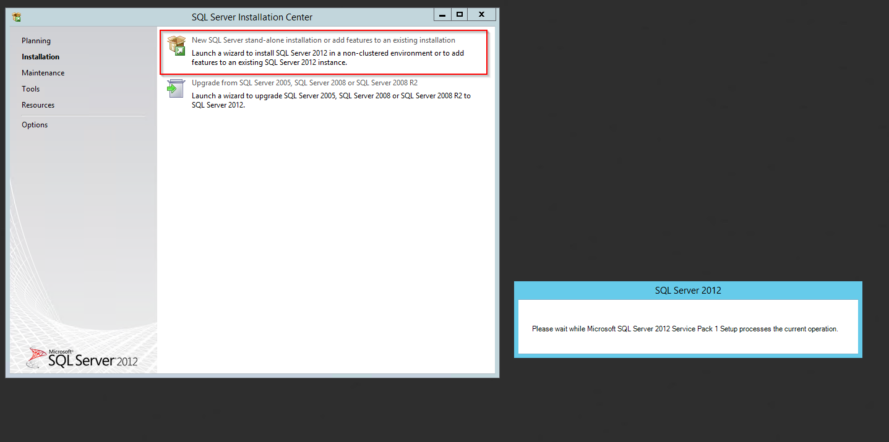

Throughout the installation, please choose the same features as shown below:

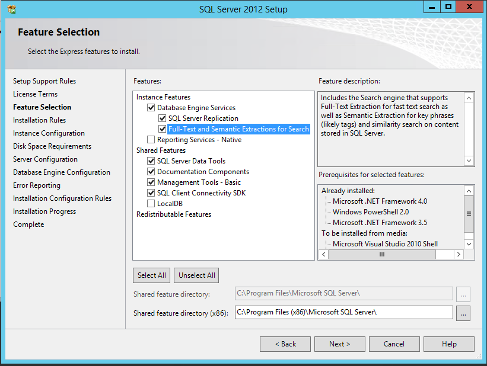

Name the instance SIM or choose another name:

.. image:: _static/install/SQLServerInstallation_02.png

Configure the server as follows:

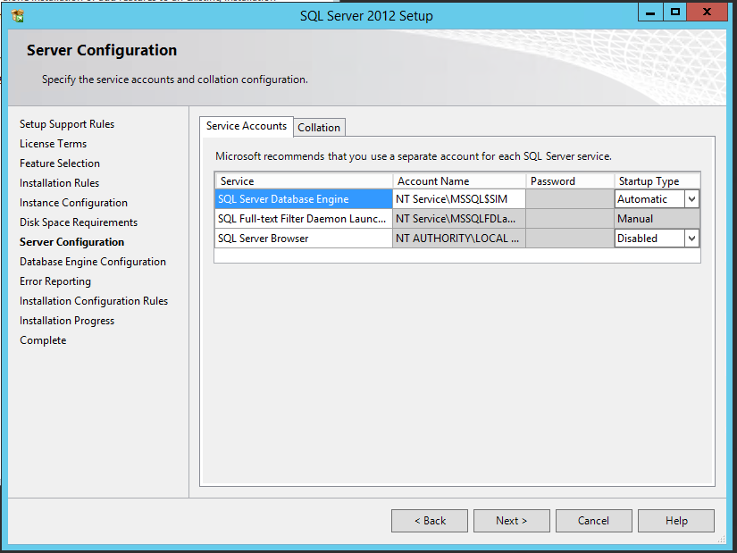

Customize the Database Engine

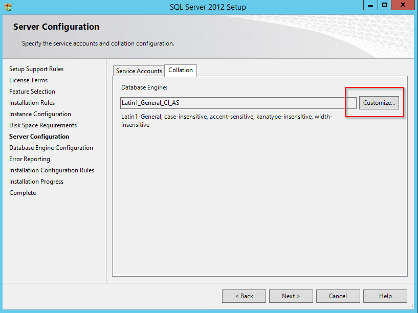

Choose the Database Engine called 'SQL_Latin_General_CP1_CI_AS': 

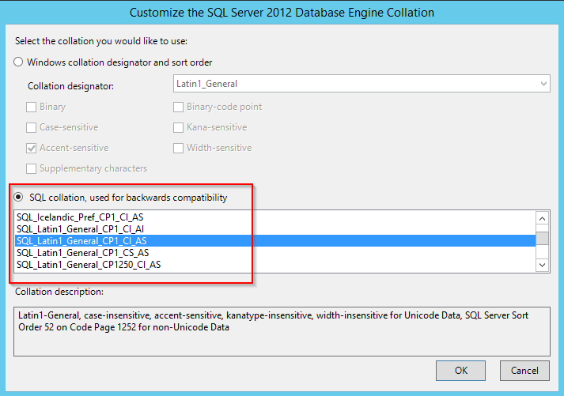

Select the 'mixed mode'-authentification and add your AD service account for SQL (``sim-svc-sql``) as SQL Server administrator:

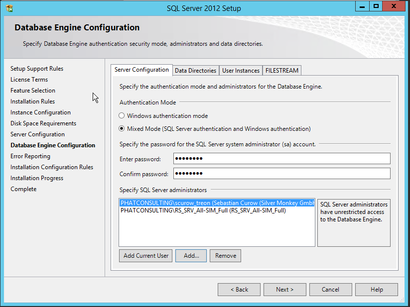

You have completed the setup!

SQL Server TCP/IP Configuration
^^^^^^^^^^^^^^^^^^^^^^^^^^^^^^^^^^^^^^^^

Open the SQL Server Configuration Manager, choose 'SQL Server Network Configuration' and then 'Protocols for [Database Name]'. Change the  TCP/IP Status to *Enabled*:

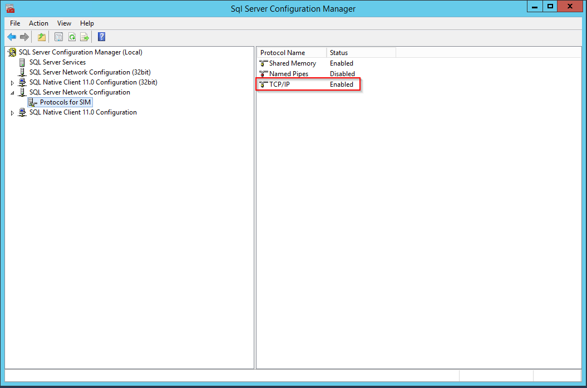

Right-click the TCP/IP line and choose 'Properties':

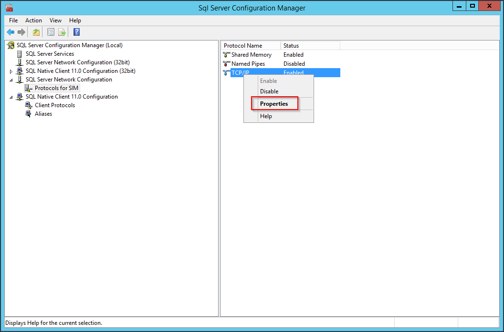

Choose the tab "IP Adresses" and change the 'TCP Port'-entry to 1433:

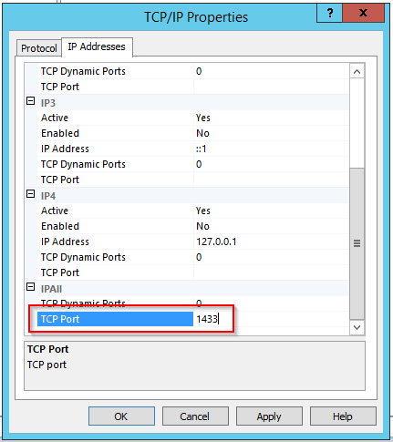

Afterwards, navigate to the SQL Server Services and restart the 'SQL Server ([Database Name]):

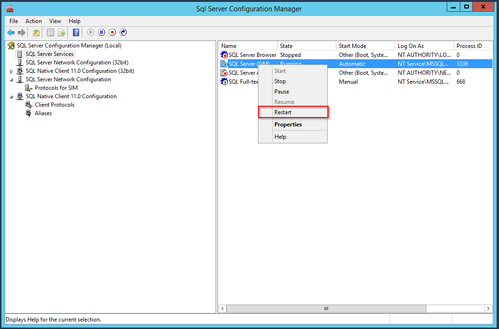

SIM SQL DB Installation
^^^^^^^^^^^^^^^^^^^^^^^^^^^^^^^^

#. Create database ``SIM_v61_R001``
#. Grant SilverMonkey Service Account (``sim-svc-sql``) "db_owner" rights for the corresponding database

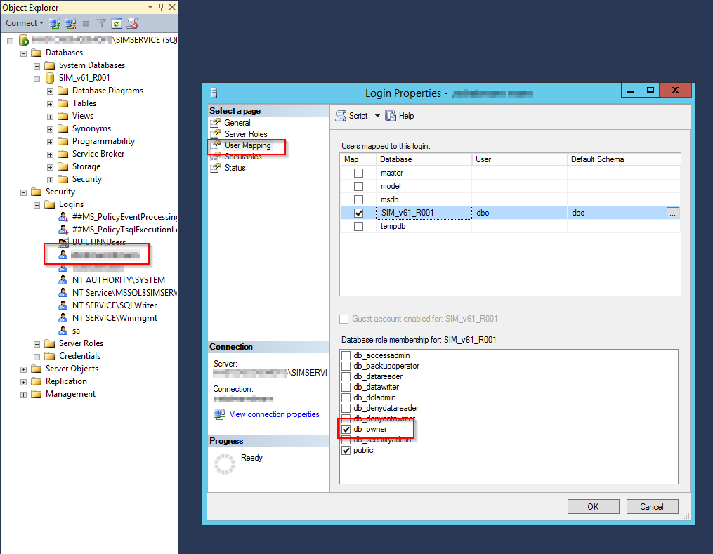

#. Import .SQL file from installation media (.\\Database) into SQL Management Studio
#. Make sure the **USE** command aims to the correct database created above and execute script

Configure IIS
-------------

Create IIS App Pool
^^^^^^^^^^^^^^^^^^^^^^^^^^^^^^^^

1. Go to IIS Manager and create an AppPool with .NET CLR version set to ``No Managed Code`` :

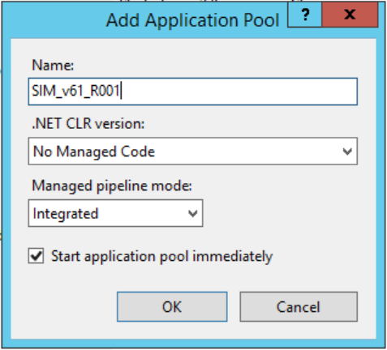

2. Go into the Advanced Settings of this AppPool and change the ``Process Model - Identity`` : 

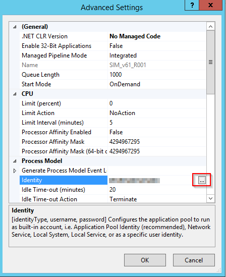

3. Make sure to use a custom user account, i.e. the Service Account (``sim-svc-sql``)

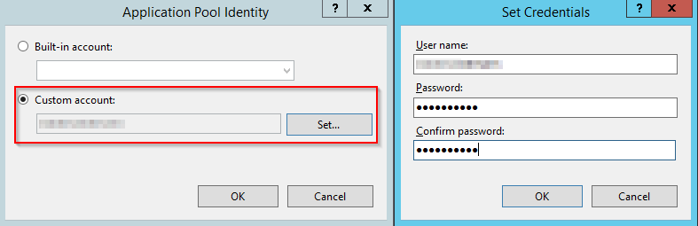

Create SilverMonkey folder
^^^^^^^^^^^^^^^^^^^^^^^^^^^^^^^^

#. Create C:\\SilverMonkey
#. Copy files from installation media
#. Change connection string in file **C:\\SilverMonkey\\v61\\Config.xml** (XPath: //Configuration/DBConnection)

Create IIS Application
^^^^^^^^^^^^^^^^^^^^^^^^^^^^^^^^

#. Go to IIS Manager, DefaultWebSite (or other Website, make sure to disable Impersonation)
#. Add application, choose SIM AppPool (created above) and target to C:\\SilverMonkey\\Web\\R001 (an alias can be set optionally)

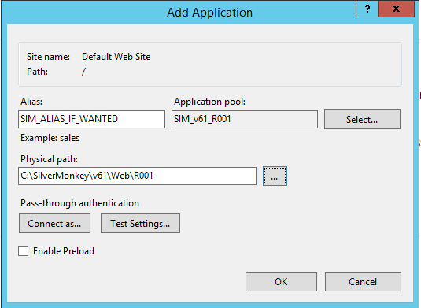

Install Windows Service
-------------------------

#. Go to C:\\SilverMonkey\\v61\\WinService
#. Execute **Install.cmd** with administrative rights
#. Open services.msc and make sure that the Windows Service **SIMv61Service** is installed

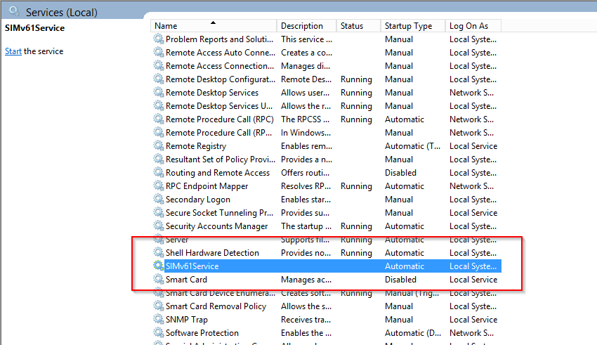

#. Go into the properties of this service and change the Log On Account to the Service Account

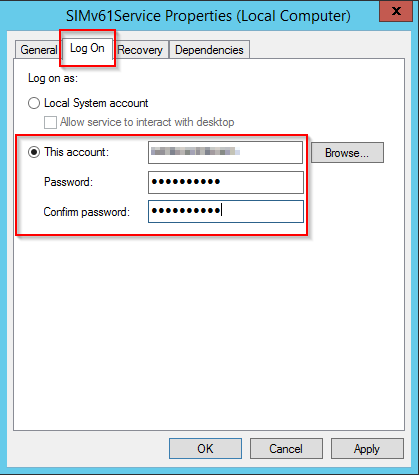

Test Installation
----------------------------------------

.. note:: For testing API download Postman: https://www.getpostman.com/ 

Test Query
^^^^^^^^^^^^^^^^^^

#. Start Postman
#. Select **GET** as option
#. Enter URL: http://SERVERNAME/APP_NAME/api/query?uniquename=TestQuery
#. Hit execute

The following result should appear:

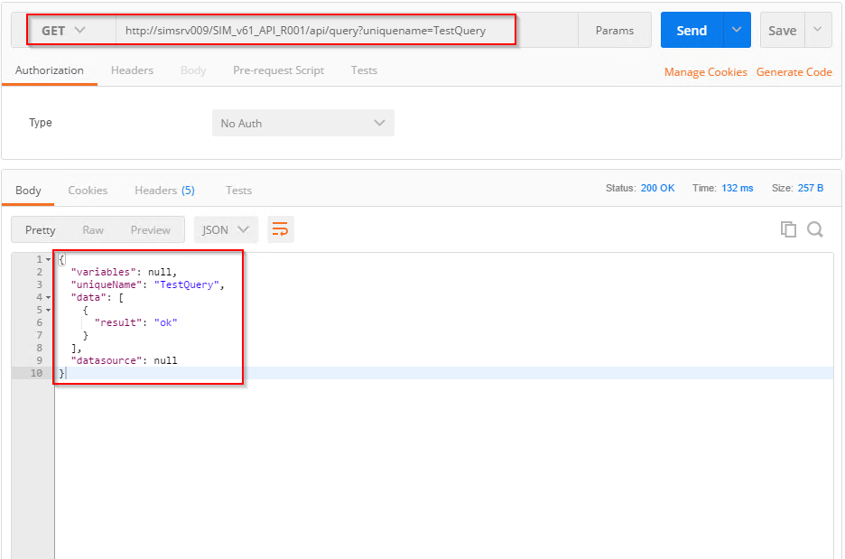

Test Queue
^^^^^^^^^^^^^^^^^^

#. Start Postman
#. Select **POST** as option
#. Enter URL: http://SERVERNAME/APP_NAME/api/Queue
#. Add following code to body:

.. code-block:: json
 {"definition": "<Definition><Plugin>TestPlugin</Plugin><Data><ExampleString>HelloWorld</ExampleString></Data></Definition>"}
 
#. Hit execute

The following result should appear:

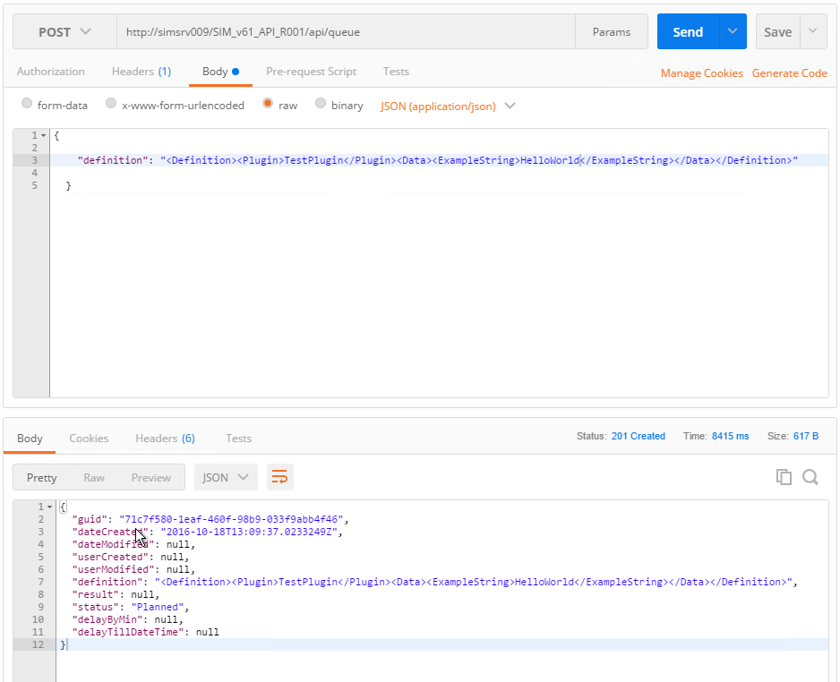

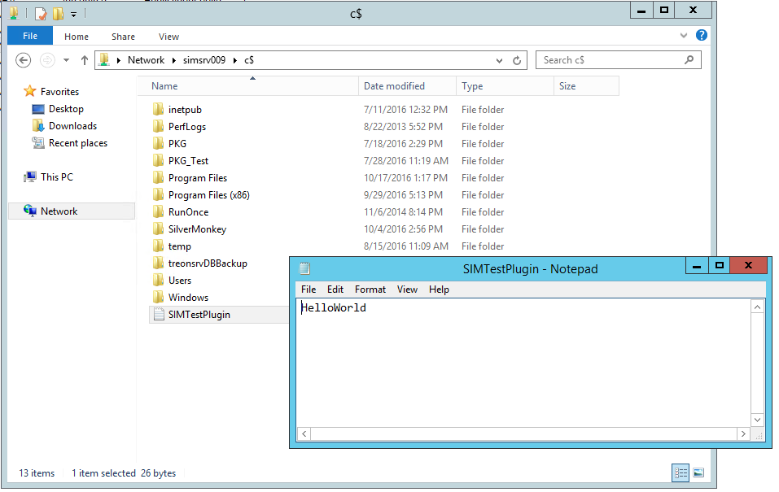