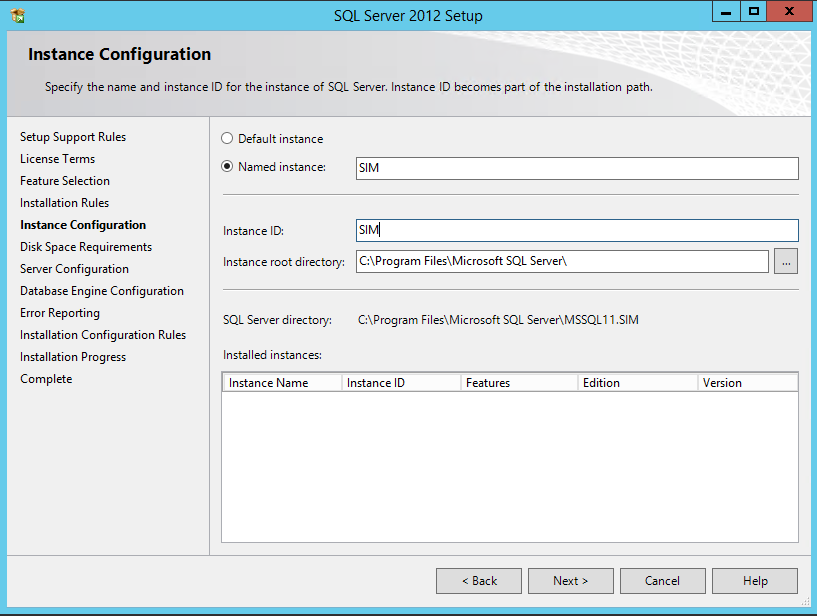

Installation
=============

.. contents:: `In this article:`
    :depth: 2
    :local:
    

Requirements
----------------------------
#. For general information on system requirements see :doc:`/Requirements`.
#. Microsoft Active Directory Service Account for accessing SIM SQL DB (in this article ``sim-svc-sql``)

IIS Features
----------------------------
Execute the following command to enable IIS features on the application server:

  .. literalinclude:: /_static/Install.cmd
    :language: batch

See :download:`Download Script </_static/Install.cmd>`.

Microsoft SQL Server
----------------------------
For information about supported SQL Server versions see :doc:`/SupportedConf`

The installation of the SQL Server will be described in the following steps.

Installation Setup
^^^^^^^^^^^^^^^^^^^^
Start the SQL Server installation setup.
Choose the "New SQL Server stand-alone installation..."-Option in the follwing Window:

.. image:: _static/install/SQLServerInstallation_00.png

Throughout the installation, please choose the same features as shown below:

.. image:: _static/install/SQLServerInstallation_01.png

Name the instance SIM or choose another name:

Configurate the server as follows:

.. image:: _static/install/SQLServerInstallation_03.png

Choose the Database Engine called 'SQL_Latin_General_CP1_CI_AS': 

.. image:: _static/install/SQLServerInstallation_04.png

Select the 'mixed mode'-authentification and add your SQL service account (``sim-svc-sql``) as SQL Server administrator:

.. image:: _static/install/SQLServerInstallation_05.png

You have completed the setup!

SQL Server TCP/IP Configuration
^^^^^^^^^^^^^^^^^^^^^^^^^^^^^^^^^^^^^^^^

Open the SQL Server Configuration Manager, choose 'SQL Server Network Configuration' and then 'Protocols for [Database Name]'. Change the  TCP/IP Status to *Enabled*:

.. image:: _static/install/SQLServerInstallation_06.png

Right-click the TCP/IP line and choose 'Properties':

.. image:: _static/install/SQLServerInstallation_07.png

Choose the tab "IP Adresses" and change the 'TCP Port'-entry to 1433:

.. image:: _static/install/SQLServerInstallation_08.png

Afterwards, navigate to the SQL Server Services and restart the 'SQL Server ([Database Name]):

.. image:: _static/install/SQLServerInstallation_09.png

SIM SQL DB Installation
^^^^^^^^^^^^^^^^^^^^^^^^^^^^^^^^

#. Create database ``SIM_v61_R001``
#. Grant SilverMonkey Service Account (``sim-svc-sql``) "db_owner" rights for the corresponding database
#. Import .SQL file from installation media (.\\Database) into SQL Management Studio
#. Make sure the **using** command aims to the correct database created above and execute script

Install IIS
-------------

Install the .NET Core Windows Server Hosting bundle
^^^^^^^^^^^^^^^^^^^^^^^^^^^^^^^^^^^^^^^^^^^^^^^^^^^^^^^^^^^^^^^^

#. Install the `.NET Core Windows Server Hosting <https://go.microsoft.com/fwlink/?LinkID=827547>`__ bundle on the server. The bundle will install the .NET Core Runtime, .NET Core Library, and the ASP.NET Core Module. The module creates the reverse-proxy between IIS and the Kestrel server.
#. Restart the server or execute **net stop was /y** followed by **net start w3svc** from the command-line to pickup changes to the system PATH.

Create IIS App Pool
^^^^^^^^^^^^^^^^^^^^^^^^^^^^^^^^

1. Go to IIS Manager and create the following AppPool:

.. image:: _static/install/AppPool.png

2. Make sure to set up a specific user account for the AppPool which has 

Create SilverMonkey folder
^^^^^^^^^^^^^^^^^^^^^^^^^^^^^^^^

#. Create C:\\SilverMonkey
#. Copy files from installation media
#. Change connection string in file **C:\\SilverMonkey\\v61\\Config.xml** (XPath: //Configuration/DBConnection)

Create IIS Application
^^^^^^^^^^^^^^^^^^^^^^^^^^^^^^^^

#. Go to IIS Manager, DefaultWebSite (or other Website, make sure to disable Impersonation)
#. Add application, choose SIM AppPool (created above) and target to C:\\SilverMonkey\\Web\\R001

Install Windows Service
-------------------------

#. Go to C:\\SilverMonkey\\v61\\WinService
#. Execute **Install.cmd** with administrative rights
#. Open services.msc and make sure, the Windows Service **SIMv61Service** is installed

Test Installation
----------------------------------------

..note:: For testing API download Postman: https://www.getpostman.com/ 

Test Query
^^^^^^^^^^^^^^^^^^

#. Start Postman
#. Select **GET** as option
#. Enter URL: http://SERVERNAME/APP_NAME/api/query?uniquename=TestQuery
#. Hit execute

The following result should appear:

..note:: For testing API download Postman: https://www.getpostman.com/ 

Test Queue
^^^^^^^^^^^^^^^^^^

#. Start Postman
#. Select **POST** as option
#. Enter URL: http://SERVERNAME/APP_NAME/api/Queue
#. Add following code to body: {"definition": "<Definition><Plugin>TestPlugin</Plugin><Data><ExampleString>HelloWorld</ExampleString></Data></Definition>"}
#. Hit execute

The following result should appear:

