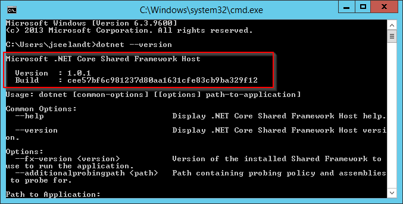

Requirements
============

Application Server (IIS)
----------------------------
-	Microsoft Windows Server 2012 or higher
-	Internet Information Server
-	Microsoft .NET Core 1.0

To Check if .Net Core 1.0 is installed, run the following cmd command and check the output.

.. literalinclude:: /_static/install/Test-dotnet_Core1.0.1.cmd
  :language: batch

- Microsoft .NET Framework 4.6.1
  
  - https://support.microsoft.com/en-us/kb/3102436
  - With Windows Server 2012, the installation requires Windows Update KB2919355, which may be included in your update stream
  - If not already included, please install manually as described here: https://support.microsoft.com/en-us/kb/2919355

Install the .NET Core Windows Server Hosting bundle
^^^^^^^^^^^^^^^^^^^^^^^^^^^^^^^^^^^^^^^^^^^^^^^^^^^^^^^^^^^^^^^^

#. Install VC Redist 2015: https://www.microsoft.com/en-us/download/details.aspx?id=53840
#. Install the `.NET Core Windows Server Hosting <https://go.microsoft.com/fwlink/?LinkID=827547>`__ bundle on the server. The bundle will install the .NET Core Runtime, .NET Core Library, and the ASP.NET Core Module. The module creates the reverse-proxy between IIS and the Kestrel server.
#. Restart the server or execute **net stop was /y** followed by **net start w3svc** from the command-line to pickup changes to the system PATH.

.. important:: Make sure that module is available in IIS/Modules: 
  
  .. image:: _static/install/AspNetCoreModule.png

Database Server (SQL)
----------------------------
-	Microsoft SQL Server 2012 or higher 
-	Or Microsoft SQL Server Express with Advanced Services

  -	2012: http://www.microsoft.com/en-us/download/details.aspx?id=29062 (ENU\x86\SQLEXPRADV_x86_ENU.exe)
  -	2014: https://www.microsoft.com/en-US/download/details.aspx?id=42299  

.. important:: Make sure to download "ADV" package: 

  .. image:: _static/install/SQLServerDownload.png

Server Hardware Requirements (IIS+SQL)
--------------------------------------------------------
The system requirements for processors, RAM and hard disk space depend on the size of the correspondig ConfigMgr environment and the number of users working at the same time. Anyway, there is always the option to easily move the application to a more powerful machine or to distribute it across several servers with load balancing.

In addition to the requirements of the operating system, the following conditions arise:
^^^^^^^^^^^^^^^^^^^^^^^^^^^^^^^^^^^^^^^^^^^^^^^^^^^^^^^^^^^^^^^^^^^^^^^^^^^^^^^^^^^^^^^^^^^^^^^^
- CPU	1GHz
- RAM	2GB
- Database size	500MB
- Website/Application files	50MB

(Valid for up to 10,000 systems and 20 concurrent users on the Web Application)

Workplace Systems
----------------------------
-	Microsoft Internet Explorer 8 or higher
-	Mozilla FireFox 5 or higher (Windows SSO is not supported by browser)
-	Google Chrome

